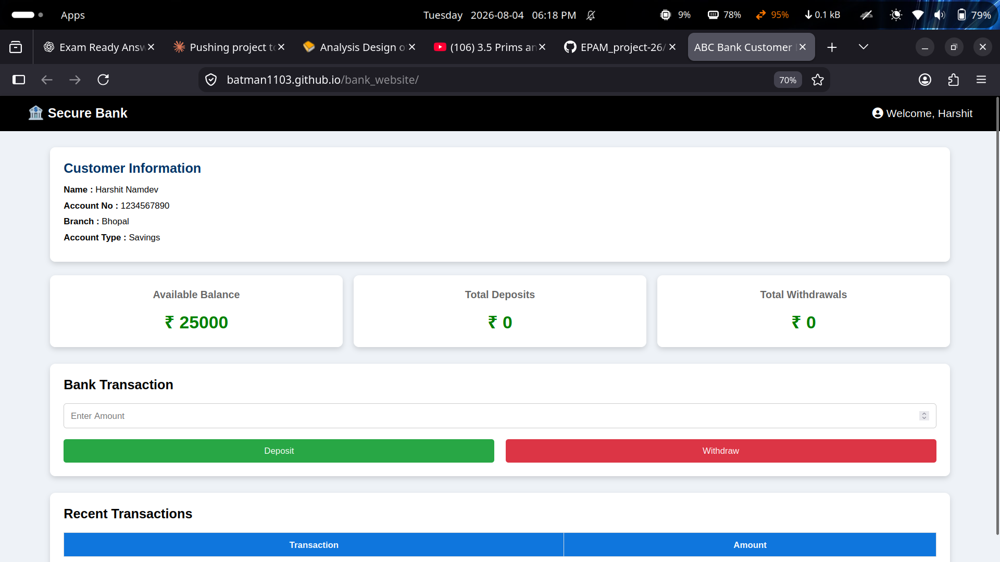

# Assignment 01


<p align="center">


</p>

---

## 📖 Overview

This project was developed as part of the **EPAM Centre of Excellence (COE) Program 2026**.

It demonstrates the implementation of a responsive web interface using modern front-end development practices with clean, maintainable, and well-structured code.

---

## ✨ Features

* Responsive design
* Modern UI/UX
* Semantic HTML5
* Clean CSS architecture
* Interactive JavaScript
* Cross-browser compatibility
* Optimized layout

---

## 🚀 Live Demo

🔗 **Demo:**
[https://batman1103.github.io/bank_project/](https://batman1103.github.io/bank_website/)

---

## 📸 Screenshots

### Desktop View

<p align="center">

</p>

---


## 🛠 Tech Stack

| Technology | Purpose            |
| ---------- | ------------------ |
| HTML5      | Structure          |
| CSS3       | Styling            |
| JavaScript | Interactivity      |
| Git        | Version Control    |
| GitHub     | Repository Hosting |

---

## 📂 Project Structure

```text
Assignment-01/
│
├── index.html
├── style.css
├── script.js
│
├── screenshots/
│   ├── desktop.png
│
└── README.md
```

---

## ⚙️ Getting Started

Clone the repository

```bash
git clone https://github.com/Batman1103/EPAM_project-26.git
```

Go to the project

```bash
cd Assignment-01
```

Run the project

Simply open `index.html` in your browser.

---

## 🎯 Learning Outcomes

* Responsive Web Design
* Semantic HTML
* CSS Layout Techniques
* DOM Manipulation
* Code Organization
* Git Workflow

---

## 📈 Future Improvements

* Dark Mode
* Better Animations
* Accessibility Enhancements
* Performance Optimization

---
# Assignment 2 — Trees & Graphs

A collection of medium-level **Tree and Graph** problems implemented in **C++**, focusing on traversal, path computation, shortest paths, and efficient graph representation.

---

## 📌 Overview

This assignment covers two problems designed to strengthen fundamental graph and tree problem-solving techniques.

| #  | Problem                    | Primary Approach    | Complexity |
| -- | -------------------------- | ------------------- | ---------- |
| 01 | Tree of Trusted Servers    | DFS + Path XOR      | `O(N)`     |
| 02 | Emergency Route Validation | BFS + Shortest Path | `O(N + M)` |

---

## 🧩 Problem 01 — Tree of Trusted Servers

### Problem Summary

The network is represented as a tree rooted at **Server 1**. Each server contains an integer security key.

For every server, calculate the XOR of all keys on the path from the root to that server. A server is considered **trusted** if its path XOR is greater than or equal to a given threshold `K`.

### Approach

A DFS traversal is used to visit every server while maintaining the XOR value accumulated from the root.

For each node:

```text
pathXOR = parentPathXOR ^ currentNodeValue
```

The resulting value is compared with `K` to determine whether the server is trusted.

### Key Concepts

* Tree Traversal
* DFS
* XOR
* Path-based computation
* Adjacency List

### Complexity

```text
Time:  O(N)
Space: O(N)
```

---

## 🧩 Problem 02 — Emergency Route Validation

### Problem Summary

The transportation network is represented as a connected undirected graph. Starting from **City 1**, determine how many cities can be reached using at most `D` roads.

### Approach

Since every road has equal cost, **Breadth-First Search (BFS)** is used to calculate the shortest distance from City 1 to every other city.

A distance array stores the minimum number of roads required to reach each city.

A city is counted when:

```text
distance[city] <= D
```

### Key Concepts

* Graph Traversal
* BFS
* Shortest Path in an Unweighted Graph
* Adjacency List
* Distance Array

### Complexity

```text
Time:  O(N + M)
Space: O(N + M)
```

---

## 🛠️ Tech Stack

* **Language:** C++
* **Compiler:** GCC / g++
* **Core Concepts:** Data Structures & Algorithms
* **Graph Representation:** Adjacency List

---

## 📁 Project Structure

```text
Assignment-2/
│
├── Problem1.cpp
├── Problem2.cpp

```

---

## 🚀 Getting Started

### Prerequisites

Make sure C++ and `g++` are installed.

Check the compiler:

```bash
g++ --version
```

### Compile and Run

#### Problem 1

```bash
g++ Problem1.cpp -o Problem1
./Problem1
```

#### Problem 2

```bash
g++ Problem2.cpp -o Problem2
./Problem2
```

The programs read input from **standard input** and print the result to **standard output**.

---

## 🎯 Learning Outcomes

This assignment demonstrates practical implementation of:

* Tree and graph representations
* DFS and BFS traversal
* Path information propagation
* Shortest-path computation in unweighted graphs
* Efficient adjacency-list implementation
* Complexity analysis

---


## 👨‍💻 Author

**Harshit Namdev**

* GitHub: https://github.com/Batman1103
* Portfolio: https://batman1103.github.io/Portfolio/
* LinkedIn: https://linkedin.com/in/your-linkedin

---

## ⭐ Support

If you found this project useful, consider giving it a **⭐ Star**.

It motivates me to continue building and improving open-source projects.

---

<p align="center">

Made with ❤️ during the **EPAM Centre of Excellence (COE) Program 2026**

</p>
